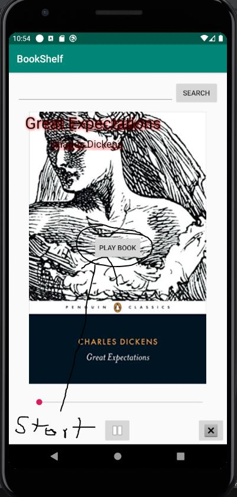
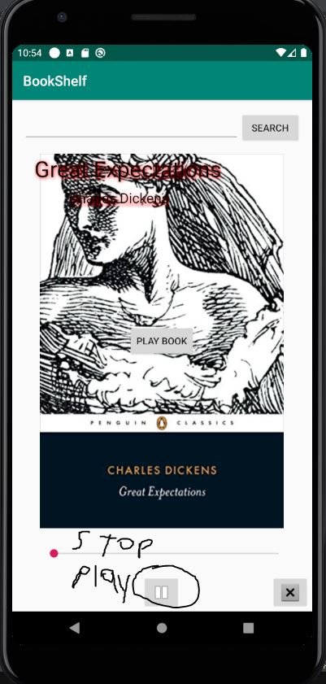
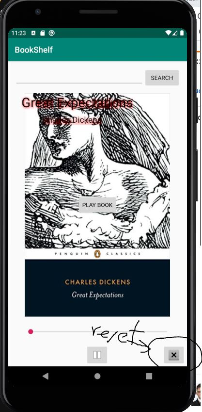
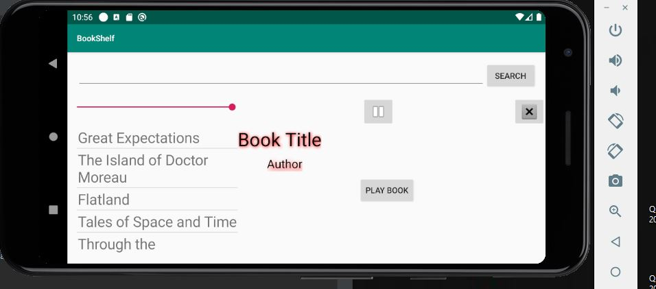

# Francesko Racaku
# AudioBookCIS-3515 
Update of previous assignment. Added audio book service.

My Application have the listed features:
1- Download audiobooks
2- Delete audiobooks if a copy was downloaded
3- Plays, stops, restarts the downloaded version of audiobooks
4- It keeps the current book even when rotation feature is used
5- The progress of the Book is saved when a book is paused.
6- Keeps track of books from the last search

Here are some pictures with instructions on how to use my App:

##Click the Play Book button to start 

##Over here

##Play and Stop Button

##Reset Button

##Rotation showing it still works after rotation

